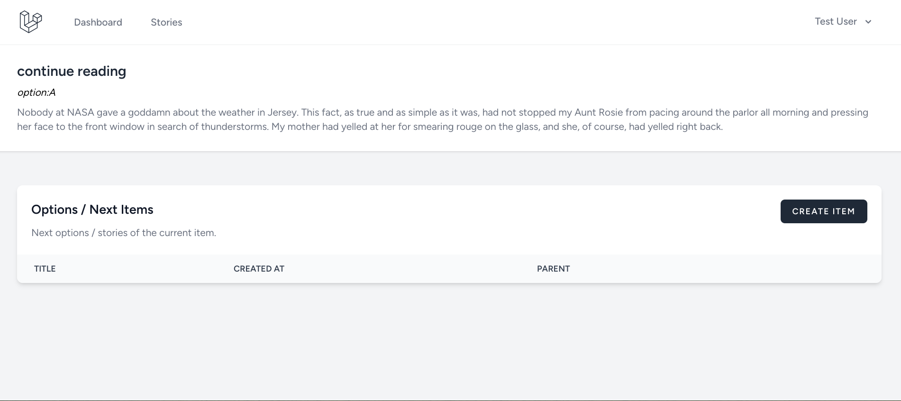

## Interactive Story Teller

Interactive story telling platform. Built with Laravel and Inertia (ReactJS).

## Installation

To run this project simplly run the commands below.
Open your terminal in computer run these commands sequencially.

-   `git clone https://github.com/ashraful-raju/interactive-story.git story`
-   `cd story`
-   `cp .env.example .env` and configure the `.env` file
-   `composer install`
-   `yarn install` or `npm install`
-   `php artisan key:generate`
-   `php artisan migrate --seed`
-   `yarn build`
-   `php artisan storage:link`
-   `php artisan serve`

### Screenshots

